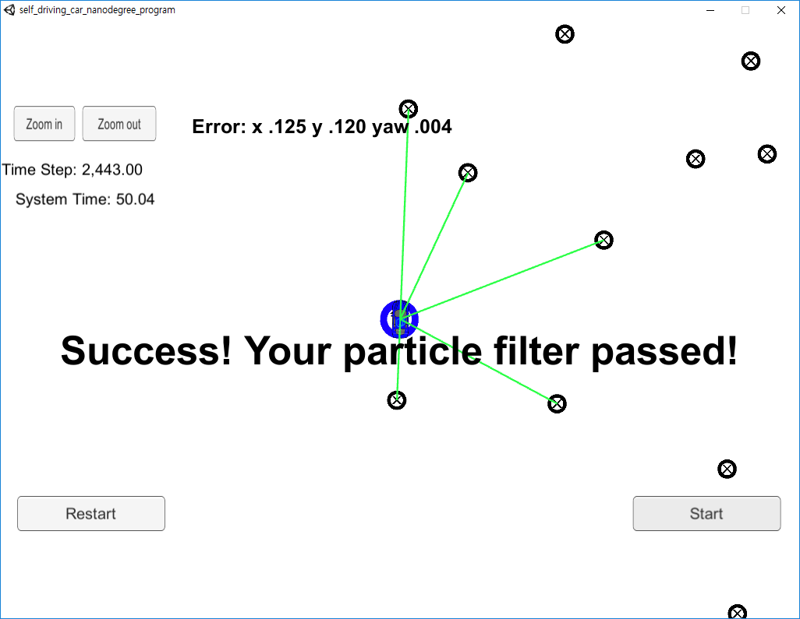

# **Kidnapped Vehicle Project**

## Goal
- Implement particle filter to localize the moving vehicle
- To pass, get low RMSE (Root Mean Square Error) of vehicle position (x,y) and heading direction (yaw)

## Result
- RMSE of x,y < 0.13[m]
- RMSE of yaw <= 0.04[rad]
